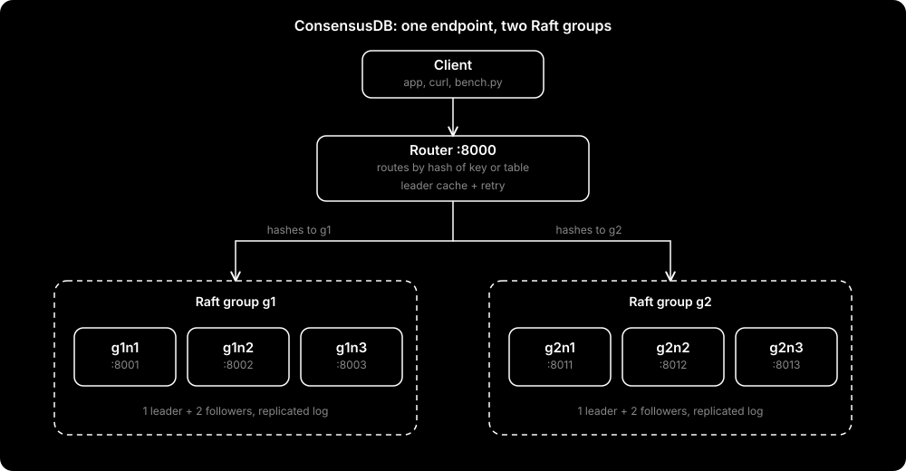
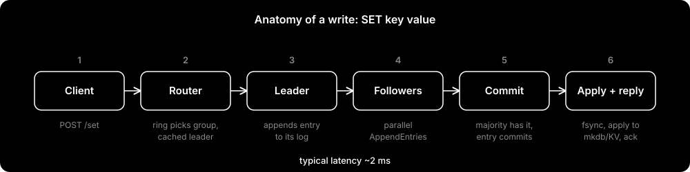
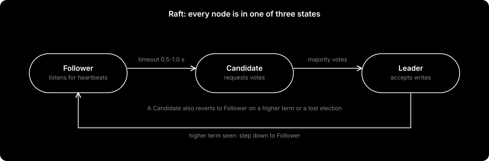
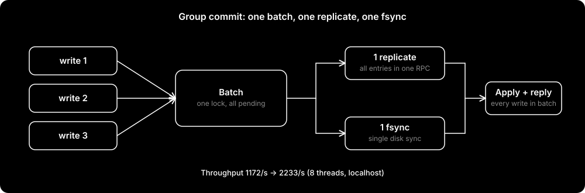
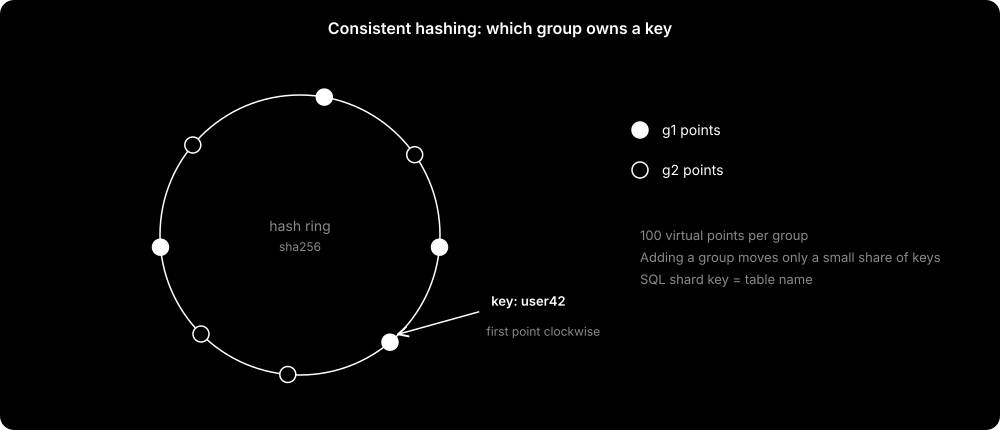
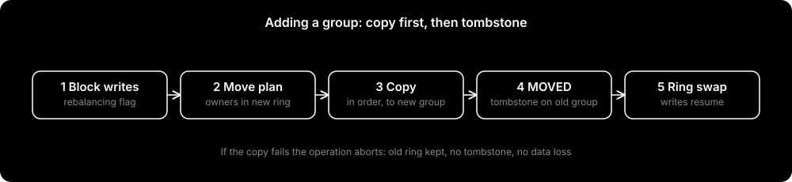
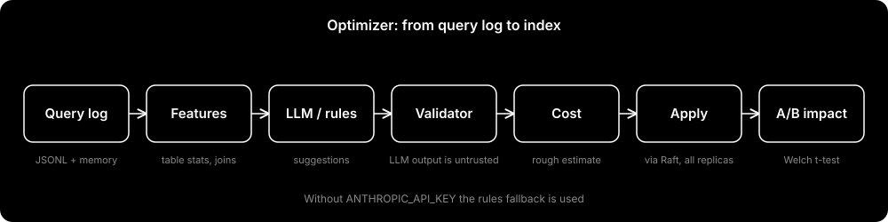

# ConsensusDB

Distributed database: **Raft replication + consistent-hash sharding + index optimizer**, ek C++ database ([mkdb](https://github.com/arvindkumar-ship-it/kuchh-nhi-)) ke upar. Python stdlib only.

| | |
|---|---|
| Replication | 3 replicas per group, Raft (election, log replication, persistence) |
| Sharding | 2 groups, consistent hashing, 100 vnodes per group |
| Failover | leader marne par ~0.65 s, 0 lost writes |
| Throughput | group commit se 1172/s se 2233/s |
| Optimizer | query log, LLM ya rules se index suggest, validator, cost, A/B test |
| Tests | 55 test functions, randomized chaos test (crash + partition) |

Saare numbers ek laptop pe localhost naape hain. Relative improvement bharosemand hai, absolute numbers real network pe alag honge.



---

## Problem

Saara data ek server pe ho to teen dikkatein hain: server marne par app band, users badhne par ek machine ki limit, aur index kaunsa lagana hai ye insaan guess karta hai.

| Dikkat | Jawab |
|---|---|
| Server marna | Har shard ki 3 copies, leader marne par vote se naya leader |
| Ek machine ki limit | Data 2 groups me baanta, router sahi group me bhejta hai |
| Index guess | Query log se pattern, suggestion, validation, A/B proof |

Ye load balancer nahi hai. Load balancer request kisi bhi server ko bhej deta hai. Yahan request us group me jaati hai **jiske paas wo data hai**, aur write majority ack ke baad hi "ok" hota hai. Closest real systems: etcd, CockroachDB, TiDB.

---

## Kaise kaam karta hai

### Write path



- Router cached leader pe jaata hai, to normal case me leader dhoondne ka extra hop nahi.
- Leader saare **alive** followers ko parallel push karta hai. Latency = sabse slow alive follower.
- Entry tab commit hoti hai jab majority ke paas ho **aur** uska term current term ho.
- Followers ko naya commit index agle AppendEntries (heartbeat) me milta hai, tab wo apply karte hain.
- Reads (`/get`, `/query`) leader ki local state se aate hain.

### Raft



Implementation `distributed/raft_node.py` me hai, network se alag. Isliye in-memory tests aur real HTTP cluster **same code** chalate hain.

| Cheez | Value |
|---|---|
| 1 tick | 0.1 s |
| Election timeout | random 5 se 10 ticks (0.5 s se 1.0 s) |
| Heartbeat | har tick |
| Majority | 3 nodes me 2 |

**Vote dene ke rules:** term purana ho to mana; log candidate se zyada up-to-date ho to mana; ek term me ek hi vote. Isi se split brain nahi hota: do candidates ek term me majority nahi bana sakte.

**Naya leader** apne term ki ek `NOOP` entry daalta hai. Uske commit hote hi purane terms ki entries bhi commit ho jaati hain.

**Replication:** follower log match na kare to leader `next_index` ek peeche karke dobara bhejta hai. Conflict par follower apna conflicting hissa delete karke leader ka log leta hai.

**SQL error** (jaise duplicate key) har replica pe same aata hai, isliye state machine use nigal leta hai aur client ko error wapas milta hai. Replicas diverge nahi karte.

### Durability aur recovery

Raft log hi source of truth hai, mkdb sirf uska materialized view.

- Log `data/<id>.log` me append-only JSON lines. Fsync sirf tab jab kuch badla.
- `term` aur `voted_for` `data/<id>.meta.json` me atomic write (tmp file, fsync, rename).
- Crash me adhoori likhi aakhri line restart pe skip hoti hai.
- Restart pe mkdb ki DB file delete hoti hai aur poora log replay hota hai. Double-apply nahi hota.
- Windows pe `os.replace` lock ki wajah se fail ho to 50 baar retry.

### Group commit



Jo requests ek saath aati hain, unki entries ek saath log me jaati hain, **ek replicate** aur **ek fsync** hota hai. Jo thread pehle lock leta hai wo poori pending queue ka batch chalata hai. Load jitna zyada, batch utna bada.

### Failure handling


| Scenario | Behaviour |
|---|---|
| Ek follower marta hai | Writes chalte hain (2 of 3). Dead peer cached flag se skip, write 1 se 3 ms |
| Leader marta hai | 0.5 se 1.0 s me election, router `/status` probe se naya leader pakadta hai. Measured ~0.65 s |
| Group ke 2 node mar gaye | Us group me majority nahi, writes commit nahi hote. Doosra group chalta rehta hai |
| Network partition | Minority side commit nahi kar sakta |
| Purana leader wapas aaya | Higher term dekh ke follower ban jaata hai, log catch-up hota hai |

Do cheezein detection fast rakhti hain:

- `RemotePeer.alive` ek **cached flag** hai. Background thread har 0.2 s ping karta hai (timeout 0.3 s). Request path me liveness ka network call nahi.
- Router: naye connection pe connect timeout 0.3 s, probe 0.5 s, real call 3 s. Election chal rahi ho to leader ke liye 3 s tak wait. Retry sirf stale keep-alive pe.

### Sharding



- KV me **key** se, SQL me **table ke naam** se group chuna jaata hai. Ek table poori ek group me rehti hai.
- Do alag groups ki tables ka join execute nahi ho sakta. Optimizer iska note deta hai.
- `/mget` keys ko group ke hisaab se baant ke har group pe ek thread chalata hai (scatter-gather).

### Rebalancing



`distributed/rebalance.py` plan banata hai: naye ring me kis key/table ka owner badla. Pehle sab copy hota hai, phir source me `MOVED name` tombstone. Dobara chalane par kuch dobara move nahi hota.

---

## Optimizer



| Step | Kya hota hai |
|---|---|
| Record | Har query: pattern (literals `?` se replace), table, WHERE columns, joins, `full_scan`, latency. JSONL file + 20000 in-memory |
| Features | Raw log nahi, chhota summary: per-table stats, p95, full-scan %, joins (`cross_shard` flag), slow queries, hot keys |
| Suggest | `ANTHROPIC_API_KEY` ho to LLM, warna rules |
| Validate | Identifier regex, 1 se 3 columns, schema se cross-check, existing index reject. LLM output pe bharosa nahi, kyunki ye aage `CREATE INDEX` SQL me jaata hai |
| Cost | `full scan ~ rows * io`, `btree ~ (log2(rows) + matches) * io`, write slowdown 15% per index. Sirf ranking ke liye |
| Apply | `CREATE INDEX` Raft log se, sab replicas pe |
| Impact | Welch t-test, index se pehle vs baad ki latency (sirf us column pe filter karne wali queries) |

**Rules fallback:** table pe 20+ queries, `full_scan_pct >= 30`, aur ek column ka filter share `>= 30%`. Cross-shard join aur hot key (`>= 20%`) pe **index nahi, note**: hot key ko index theek nahi karta, cache ya read replica chahiye.

**A/B:** `sha256(experiment:key) mod 100` se bucket, same key hamesha same bucket. 30 se kam samples par `significant: null`, jhoota claim nahi.

---

## Benchmarks

Ek Windows laptop, sab `127.0.0.1`.

### Raft aur failover (KV mode)

| Cheez | Pehle | Baad me |
|---|---|---|
| Leader marne par outage | ~7.6 s | **~0.65 s** |
| Dead follower ke saath write | ~1000 ms | **1 se 3 ms** |
| SET throughput, 8 threads | 1172/s | **2233/s** |
| Failover ke baad lost writes | n/a | **0** |

### SQL: akela mkdb vs Raft cluster (`bench_results.json`)

| Phase | Akela mkdb | Raft cluster |
|---|---|---|
| insert | 1006 ops/s | 162 ops/s |
| select by pk | 24979 ops/s | 1401 ops/s |
| select by non-key (full scan) | 838 ops/s | 693 ops/s |

Ye replication ki keemat hai: har write majority tak jaata hai, aur router ka ek HTTP hop (~4 se 5 ms) har request pe lagta hai.

### Index ka asar

Optimizer ne 2 tables pe `CREATE INDEX ... (name)` suggest kiya, Raft se apply hua, wahi scan dobara chala (3 rounds, median).

| | Pehle | Baad me |
|---|---|---|
| Scan ops/s | 661.6 | **1272.7** |
| p50 latency | 11.34 ms | **5.94 ms** |

Speedup **1.92x**. Is run me impact ka p-value `null` aaya (sample window match nahi hua), isliye statistical claim yahan nahi kiya.

### Kya sabse zyada impactful tha

| # | Change | Asar |
|---|---|---|
| 1 | Router connect timeout 0.3 s | outage 7.6 s se 0.65 s |
| 2 | Cached liveness + background ping | write 1000 ms se 1 se 3 ms |
| 3 | Group commit | throughput 1.9x |
| 4 | Optimizer ka index | scan 1.92x |
| 5 | Keep-alive connections | Windows pe har connect ~15 ms bacha |
| 6 | Append-only log, fsync sirf badlav pe | leader flapping band |

### Dobara chalana

```bash
python bench.py --n 2000 --threads 1 4 8     # KV load test
python -m bench.compare --rows 1000          # SQL compare + index effect (USE_MKDB=1)
python -m bench.index_direct                 # hop-free index effect
```

---

## Engineering log

**1. Dead follower se poora cluster slow.** Ek follower marne par har write ~1000 ms ka ho gaya. Leader har write pe dead peer ko ping karta tha, aur wo bhi node ke global lock ke andar. Fix: liveness cached flag + background ping. Ab 1 se 3 ms.

**2. Leader marne par 7.6 s outage.** Pehla andaaza election timeout tha, galat nikla. Chhota experiment: Windows pe band port pe connect ~2 s leta hai (measured 2042 ms). Router dead leader pe wahi wait karta tha. Fix: connect timeout 0.3 s. Ab 647 ms.

**3. Throughput ek jagah atakta tha.** Har write ek fsync aur ek round-trip. Fix: group commit. 1172/s se 2233/s.

Teeno me pattern same hai: andaaza, measure, root cause, fix.

---

## API

**Router `:8000`** (current HEAD)

| Method | Path | Body |
|---|---|---|
| POST | `/set`, `/get`, `/del` | `{"key", "value"}` |
| POST | `/mget` | `{"keys": [...]}` |
| POST | `/sql` (write/DDL), `/query` (read) | `{"table", "sql"}` |
| GET | `/health` | har group ke nodes ka state aur term |

**Node (internal):** `/vote`, `/append` (Raft), `/client` (write), `/get`, `/query`, `/log`, `/ping`, `/status`.

---

## Quick start

Python 3.12+. SQL mode ke liye mkdb ka `mkdb_server` binary chahiye (`MKDB_SERVER` env se path).

```powershell
# KV mode: 6 nodes + router (start_all.ps1 yehi karta hai, uske paths apne hisaab se badlo)
python run_node.py g1n1   # g1n2 g1n3 g2n1 g2n2 g2n3 bhi
python router.py

Invoke-RestMethod -Method Post -Uri http://127.0.0.1:8000/set -ContentType application/json -Body '{"key":"user:1","value":"arvind"}'
Invoke-RestMethod http://127.0.0.1:8000/health
```

```powershell
# SQL mode
$env:USE_MKDB = "1"; $env:MKDB_SERVER = "D:\mkdb\build\mkdb_server.exe"
.\start_all.ps1
```

Har node apna `mkdb_server` chalata hai, port = Raft port + 20000. SQL me newline allowed nahi.

**Failover khud dekho:** `/health` se leader dekho, uska terminal band karo, 1 s me dobara `/health`. Naya leader dikhega, purani keys `/get` se milti rahengi.

```bash
python -m pytest tests -q
CHAOS_SEEDS=3000 python -m pytest tests/test_chaos.py    # gehra chaos run
```

---

## Known issues

1. **Live LLM path is optional and unverified here.** Tests skip it without a provider key.
2. **Stored benchmarks are historical.** Rerun `bench/compare.py` on your own machine; do not quote its numbers as new results.
3. **Native engine location:** install `mkdb_server` on PATH or set `MKDB_SERVER` to an absolute path. `MKDB_DLL_DIR` is optional on Windows.
4. `/stats`, `/optimize/*`, `/ab/*`, `/rebalance/add` and `ROUTER_PORT` are wired in the current router; earlier regression notes referred to older commits.

## Known limits

- Reads leader-local hain (ReadIndex ya lease nahi), partition me stale read possible.
- Snapshot ya log compaction nahi, restart pe poora log replay.
- Membership static, naya node kisi group me nahi judta.
- Leader apni fsync replicate ke baad karta hai (textbook order se alag).
- Cross-shard transaction aur join nahi. Hot table = hot shard.
- Rebalance ke dauraan writes band.
- SQL parsing regex se, poora parser nahi.
- Sab localhost pe naapa gaya.

## Design decisions

| Decision | Kyun |
|---|---|
| Raft, Paxos nahi | Samajhna aur implement karna aasan |
| Stdlib only | Zero dependency |
| Tick-based time | Deterministic, chaos test same code chalata hai |
| Raft log = source of truth | State machine disposable, double-apply impossible |
| Static config, gossip nahi | 6 nodes ke liye overkill, router probe se leader milta hai |
| Kafka ki jagah JSONL | Single machine pe wahi kaam, zero setup |
| `http.server`, FastAPI nahi | Dependency-free |

## Tests

55 test functions. mkdb binary ke saath Windows pe 54 pass, `test_llm_live` key ke bina skip.

| File | Verify karta hai |
|---|---|
| `test_chaos.py` | 5 nodes, 600 steps, random crash/restart/network cut/writes. Har step pe: ek term me ek leader, committed entry kabhi nahi badalti, naya leader committed entries rakhta hai |
| `test_election`, `test_replication`, `test_failover` | Raft ke core flows |
| `test_ring`, `test_rebalance` | Balance, minimal movement, copy-phir-tombstone, fail par abort |
| `test_keepalive`, `test_kv`, `test_mkdb_sm` | Connection reuse, state machines |
| `test_workload`, `test_hotkeys`, `test_optimizer`, `test_abtest` | Parse, features, validator (injection reject), cost, Welch |

## Layout

```
router.py  run_node.py  bench.py  start_all.ps1
distributed/   raft_node, rpc, conn, ring, rebalance, kv, mkdb_sm, config
workload/      recorder, sqlinfo, schema, hotkeys
optimizer/     features, prompt, llm_client, rules, validator, cost, optimizer, service
abtest/        experiment, stats
bench/         bench, compare, index_direct
docs/diagrams/ SVG diagrams
tests/
```

Audit repair scope, reproducible checks and remaining limitations: [AUDIT_FIXES.md](AUDIT_FIXES.md).
